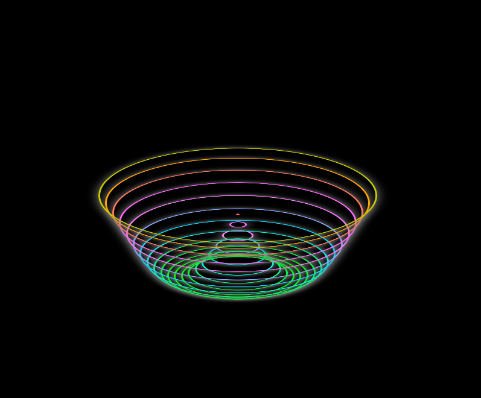

# 🌌 Neon Flux

**Neon Flux** is a mesmerizing animated visual made using HTML and CSS. It features glowing, dynamic circles that rise and pulse with a 3D-like effect, perfect for creative inspiration, backgrounds, or just to vibe out.

 

---

## ✨ Features

- 💡 Neon-glow circle animation  
- 🌐 Pure HTML + CSS (no JavaScript)  
- 🔁 Smooth infinite loop  
- 🎨 Responsive design with CSS variables  
- 🧠 Easy to customize and remix  

---

## 🚀 Live Demo

[🔗 Click here to view the animation live](https://Tanushjangid.github.io/neon-flux)


---

## 📁 Project Structure

```
Neon-Flux/
│
├── index.html        # Main HTML file
├── style.css         # All the animation magic
└── README.md         # You're reading it!
```

---

## 🛠️ How to Use

1. **Clone the repo**
   ```bash
   git clone https://github.com/Tanushjangid/neon-flux.git
   
   cd neon-flux
   ```

2. **Open `index.html` in your browser**  
   That’s it. No build tools, no setup required.

---

## 🎨 Customization

- Change the circle colors:  
  Update the `border` and `box-shadow` in `.circle`.

- Speed up or slow down the animation:  
  Edit the `animation` duration in `.circle`.

- Add more circles:  
  Copy-paste more `<div class="circle" style="--i:X;"></div>` in `index.html`.

---

## 🤝 Contributing

Pull requests and suggestions are welcome! If you have ideas for new effects or improvements, feel free to fork the repo and create a PR.

---

## 📄 License

This project is open source under the [MIT License](LICENSE).

---

## 🔥 Created with ✨ and CSS by [Your Name]
